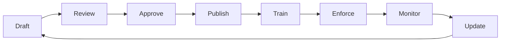
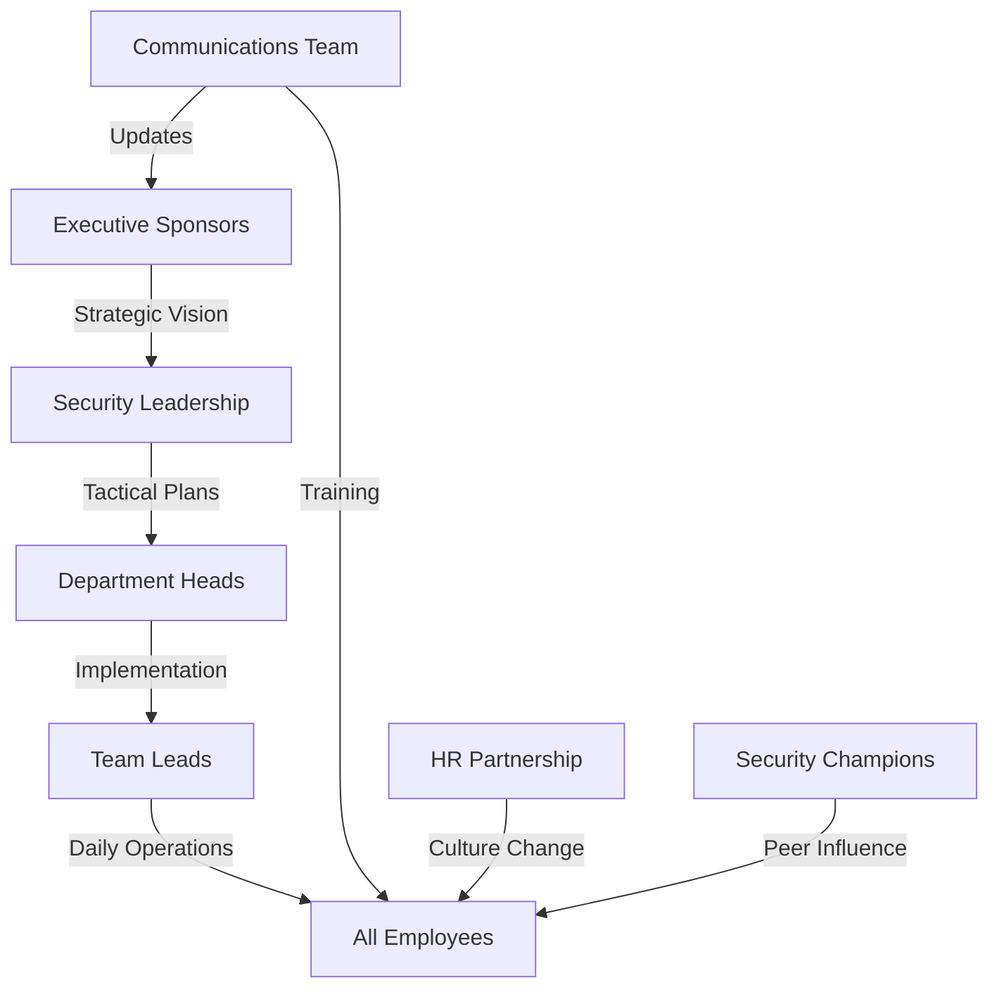
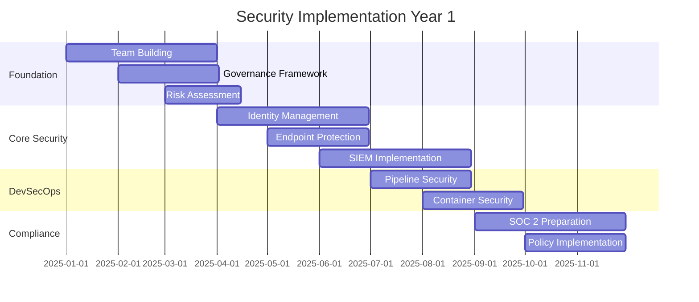

# Globomantics Security Policy Implementation Guide

## Executive Summary

This guide provides step-by-step instructions for implementing Globomantics' security policy at organizational and enterprise levels. It covers governance, technical implementation, cultural transformation, and measurement strategies to establish a world-class security program.

## Table of Contents

1. [Implementation Phases](#implementation-phases)
2. [Organizational Level Implementation](#organizational-level-implementation)
3. [Enterprise Level Implementation](#enterprise-level-implementation)
4. [Technical Implementation Roadmap](#technical-implementation-roadmap)
5. [Change Management Strategy](#change-management-strategy)
6. [Success Metrics and KPIs](#success-metrics-and-kpis)
7. [Common Challenges and Solutions](#common-challenges-and-solutions)
8. [Resource Requirements](#resource-requirements)
9. [Implementation Timeline](#implementation-timeline)
10. [Appendices](#appendices)

## Implementation Phases

### Phase 1: Foundation (Months 1-3)
- Security governance structure
- Policy framework establishment
- Initial risk assessment
- Quick wins implementation

### Phase 2: Core Implementation (Months 4-9)
- Technical controls deployment
- Process standardization
- Training program launch
- Compliance alignment

### Phase 3: Maturation (Months 10-12)
- Advanced security capabilities
- Automation and orchestration
- Continuous improvement
- Metrics and optimization

### Phase 4: Excellence (Year 2+)
- Industry leadership
- Innovation initiatives
- Zero Trust completion
- Advanced threat hunting

## Organizational Level Implementation

### 1. Establish Security Governance

#### Security Leadership Structure
```
┌─────────────────────────┐
│      Board/C-Suite      │
│   Security Committee    │
└────────────┬────────────┘
             │
┌────────────┴────────────┐
│         CISO            │
│  Chief Security Officer │
└────────────┬────────────┘
             │
┌────────────┴────────────┐
│   Security Council      │
│ Cross-functional leads  │
└────────────┬────────────┘
             │
┌────────────┴────────────┐
│  Security Champions     │
│   Embedded in teams     │
└─────────────────────────┘
```

#### Key Roles and Responsibilities

**Chief Information Security Officer (CISO)**
- Reports directly to CEO/CTO
- Quarterly board presentations
- Strategic security vision
- Budget ownership ($X million)

**Security Council Members**
- Engineering Security Lead
- Infrastructure Security Lead
- Application Security Lead
- Compliance and Risk Lead
- Security Operations Lead
- Privacy and Data Protection Lead

**Security Champions Network**
- 1-2 champions per development team
- 20% time allocation for security
- Monthly training and meetings
- Direct channel to security team

### 2. Policy Framework Development

#### Core Security Policies

1. **Information Security Policy** (Master Document)
   - Scope and applicability
   - Roles and responsibilities
   - Enforcement mechanisms
   - Annual review cycle

2. **Acceptable Use Policy**
   - Device usage guidelines
   - Network access rules
   - Data handling requirements
   - Violation consequences

3. **Access Control Policy**
   - Identity lifecycle management
   - Privileged access procedures
   - Service account governance
   - Access review schedules

4. **Incident Response Policy**
   - Classification criteria
   - Escalation procedures
   - Communication protocols
   - Post-incident reviews

5. **Data Protection Policy**
   - Classification scheme
   - Encryption requirements
   - Retention schedules
   - Privacy controls

#### Policy Lifecycle Management



### 3. Risk Management Framework

#### Risk Assessment Process

1. **Asset Inventory**
   ```yaml
   asset_categories:
     - critical_data:
         - customer_pii
         - financial_records
         - intellectual_property
     - systems:
         - production_servers
         - databases
         - api_gateways
     - applications:
         - customer_facing
         - internal_tools
         - third_party_integrations
   ```

2. **Threat Modeling**
   - STRIDE methodology for applications
   - MITRE ATT&CK for infrastructure
   - Supply chain threat analysis
   - Insider threat scenarios

3. **Risk Scoring Matrix**
   ```
   Impact x Likelihood = Risk Score
   
   5 (Critical) x 5 (Certain) = 25 (Critical Risk)
   3 (Medium)   x 2 (Unlikely) = 6 (Low Risk)
   ```

4. **Risk Treatment Options**
   - **Accept**: Document and monitor
   - **Mitigate**: Implement controls
   - **Transfer**: Insurance/contracts
   - **Avoid**: Eliminate activity

### 4. Security Awareness Program

#### Training Curriculum

**All Employees (Quarterly)**
- Security fundamentals
- Phishing awareness
- Password hygiene
- Incident reporting
- Data handling

**Developers (Monthly)**
- Secure coding practices
- OWASP Top 10 deep dives
- Security tool usage
- Threat modeling workshops
- Code review techniques

**Executives (Bi-annually)**
- Cyber risk landscape
- Regulatory compliance
- Incident scenarios
- Security investment ROI
- Board reporting

#### Engagement Strategies

1. **Gamification**
   - Security leaderboards
   - Capture the Flag events
   - Bug bounty participation
   - Recognition programs
   - Team competitions

2. **Communication Channels**
   - Weekly security tips
   - Incident case studies
   - Tool tutorials
   - Success stories
   - Q&A sessions

3. **Metrics and Tracking**
   ```json
   {
     "training_completion": "95%",
     "phishing_simulation_pass_rate": "92%",
     "security_champion_engagement": "87%",
     "incident_reporting_rate": "increased 45%",
     "security_culture_score": "4.2/5.0"
   }
   ```

## Enterprise Level Implementation

### 1. Enterprise Security Architecture

#### Zero Trust Implementation

**Phase 1: Identity-Centric Security**
```yaml
components:
  identity_provider:
    solution: "Okta/Azure AD"
    features:
      - single_sign_on
      - multi_factor_auth
      - risk_based_access
      - session_management
  
  privileged_access:
    solution: "CyberArk/HashiCorp Boundary"
    features:
      - just_in_time_access
      - session_recording
      - credential_vaulting
      - approval_workflows
```

**Phase 2: Network Segmentation**
```yaml
microsegmentation:
  solution: "Illumio/Guardicore"
  policies:
    - app_to_app_rules
    - environment_isolation
    - lateral_movement_prevention
    - encrypted_tunnels

software_defined_perimeter:
  solution: "Zscaler/Palo Alto Prisma"
  features:
    - cloud_access_broker
    - app_level_access
    - user_behavior_analytics
    - threat_prevention
```

**Phase 3: Device Trust**
```yaml
endpoint_management:
  solution: "Microsoft Intune/Jamf"
  requirements:
    - compliance_policies
    - patch_management
    - encryption_enforcement
    - app_whitelisting

device_trust:
  criteria:
    - os_version_current
    - antivirus_active
    - firewall_enabled
    - disk_encrypted
    - certificates_valid
```

### 2. Security Operations Center (SOC)

#### SOC Maturity Model

**Level 1: Reactive (Current State)**
- Basic monitoring
- Manual processes
- Limited visibility
- Ad-hoc response

**Level 2: Proactive (6 Months)**
- 24/7 monitoring
- SIEM correlation
- Playbook automation
- Threat intelligence

**Level 3: Advanced (12 Months)**
- Threat hunting
- ML/AI detection
- Orchestration (SOAR)
- Predictive analytics

**Level 4: Optimized (18+ Months)**
- Autonomous response
- Zero-day detection
- Deception technology
- Continuous validation

#### SOC Technology Stack

```yaml
siem_platform:
  primary: "Splunk Enterprise Security"
  data_sources:
    - application_logs
    - infrastructure_logs
    - security_tools
    - cloud_platforms
    - network_flows

soar_platform:
  solution: "Phantom/Demisto"
  use_cases:
    - phishing_response
    - malware_containment
    - user_deprovisioning
    - threat_enrichment
    - ticket_creation

threat_intelligence:
  platforms:
    - "Recorded Future"
    - "CrowdStrike Falcon"
    - "MISP"
  feeds:
    - commercial_feeds
    - open_source_feeds
    - industry_sharing
    - custom_indicators

endpoint_detection:
  solution: "CrowdStrike/SentinelOne"
  capabilities:
    - behavioral_analysis
    - fileless_detection
    - automated_response
    - forensics_collection
```

### 3. DevSecOps Integration

#### CI/CD Security Pipeline

```yaml
# .gitlab-ci.yml / .github/workflows/security.yml
stages:
  - pre-commit:
      - secret_scanning:
          tool: "GitLeaks/TruffleHog"
          action: "block_on_detection"
      - commit_signing:
          requirement: "gpg_verified"
  
  - build:
      - dependency_check:
          tools: ["Snyk", "WhiteSource"]
          threshold: "no_critical_vulns"
      - license_scan:
          tool: "FOSSA"
          allowed: ["MIT", "Apache-2.0", "BSD"]
  
  - test:
      - sast:
          tools: ["CodeQL", "Semgrep", "SonarQube"]
          quality_gates:
            - no_critical_issues
            - coverage_above_80
      - unit_tests:
          security_tests_required: true
  
  - package:
      - container_scan:
          tools: ["Trivy", "Twistlock"]
          base_image_requirements:
            - distroless_preferred
            - no_root_user
            - minimal_packages
      - sbom_generation:
          formats: ["SPDX", "CycloneDX"]
  
  - deploy:
      - infrastructure_scan:
          tools: ["Checkov", "Terrascan"]
          policies: "cis_benchmarks"
      - runtime_protection:
          tool: "Falco"
          policies: "custom_rules"
  
  - post-deploy:
      - dast:
          tool: "OWASP ZAP"
          scan_type: "authenticated"
      - compliance_check:
          frameworks: ["PCI-DSS", "SOC2"]
```

#### Security as Code

```python
# security_policies.py
from security_framework import Policy, Control, validate

class DataEncryptionPolicy(Policy):
    """Enforce encryption for sensitive data"""
    
    controls = [
        Control(
            id="ENC-001",
            description="Encrypt PII at rest",
            implementation="""
            All PII must be encrypted using AES-256-GCM
            with keys managed by HashiCorp Vault
            """,
            validation=lambda: validate.encryption_enabled("pii_database"),
            remediation="Enable TDE on database"
        ),
        Control(
            id="ENC-002",
            description="TLS 1.3 for data in transit",
            implementation="""
            All API endpoints must use TLS 1.3 minimum
            with strong cipher suites only
            """,
            validation=lambda: validate.tls_version(">=1.3"),
            remediation="Update TLS configuration"
        )
    ]
    
    def assess_compliance(self):
        return all(control.validate() for control in self.controls)
```

### 4. Cloud Security Architecture

#### Multi-Cloud Security Strategy

**AWS Security Stack**
```yaml
preventive_controls:
  - AWS Organizations + SCPs
  - AWS Config Rules
  - AWS WAF + Shield
  - GuardDuty
  - Security Hub

detective_controls:
  - CloudTrail + EventBridge
  - VPC Flow Logs
  - Access Analyzer
  - Macie (data discovery)

responsive_controls:
  - Lambda security automation
  - Systems Manager
  - Incident Manager
  - Step Functions workflows
```

**Azure Security Stack**
```yaml
preventive_controls:
  - Azure Policy
  - Azure Firewall
  - DDoS Protection
  - Key Vault
  - Defender for Cloud

detective_controls:
  - Azure Monitor
  - Log Analytics
  - Sentinel (SIEM)
  - Compliance Manager

responsive_controls:
  - Logic Apps automation
  - Runbooks
  - Security Center workflows
  - Azure Functions
```

**GCP Security Stack**
```yaml
preventive_controls:
  - Organization Policies
  - Cloud Armor
  - Binary Authorization
  - VPC Service Controls
  - Security Command Center

detective_controls:
  - Cloud Logging
  - Cloud Asset Inventory
  - Event Threat Detection
  - DLP API

responsive_controls:
  - Cloud Functions
  - Workflows
  - Cloud Run automation
  - Pub/Sub notifications
```

## Technical Implementation Roadmap

### Quarter 1: Foundation
```gantt
dateFormat  YYYY-MM-DD
title Security Implementation Q1

section Governance
Security team hiring    :2025-01-01, 30d
Policy development      :2025-01-15, 45d
Risk assessment        :2025-02-01, 30d

section Quick Wins
MFA deployment         :2025-01-07, 21d
Vulnerability scanning :2025-01-14, 14d
Security training      :2025-02-01, 60d

section Infrastructure
SIEM deployment        :2025-02-15, 45d
Network segmentation   :2025-03-01, 30d
```

### Quarter 2: Core Security
- Endpoint protection rollout
- Identity governance implementation
- DevSecOps pipeline integration
- Incident response procedures
- Third-party risk program

### Quarter 3: Advanced Capabilities
- Zero Trust phase 1
- Threat hunting program
- Security automation
- Cloud security posture
- Compliance automation

### Quarter 4: Optimization
- AI/ML security analytics
- Deception technology
- Advanced threat prevention
- Security metrics dashboard
- Continuous improvement

## Change Management Strategy

### 1. Stakeholder Engagement Plan



### 2. Communication Strategy

**Communication Channels**
- Executive town halls (quarterly)
- Department briefings (monthly)
- Security newsletters (weekly)
- Slack channels (#security-updates)
- Internal wiki/documentation
- Training platforms

**Key Messages**
1. "Security is everyone's responsibility"
2. "Protecting customer trust"
3. "Enabling business growth securely"
4. "Building competitive advantage"
5. "Compliance as a byproduct"

### 3. Resistance Management

**Common Objections and Responses**

| Objection | Response | Action |
|-----------|----------|--------|
| "Security slows us down" | Show automation benefits | Implement fast-path approvals |
| "Too many new tools" | Provide comprehensive training | Create tool champions |
| "Not my job" | Link to performance goals | Include in job descriptions |
| "Too complex" | Simplify where possible | Provide clear documentation |
| "No time for training" | Make it mandatory and paid | Schedule during work hours |

## Success Metrics and KPIs

### Security Metrics Dashboard

```yaml
operational_metrics:
  patching_compliance:
    target: ">95% within SLA"
    current: "92%"
    trend: "improving"
  
  vulnerability_management:
    critical_mttr: "<24 hours"
    high_mttr: "<7 days"
    scan_coverage: "100%"
  
  incident_response:
    mttd: "<1 hour"
    mttr: "<4 hours"
    false_positive_rate: "<10%"

strategic_metrics:
  security_maturity_score:
    current: "2.8/5.0"
    target: "4.0/5.0"
    timeline: "18 months"
  
  risk_reduction:
    high_risks_closed: "75%"
    risk_score_trend: "-35%"
    compliance_gaps: "12 → 3"
  
  security_culture:
    training_completion: "98%"
    phishing_resistance: "95%"
    incident_reporting: "+200%"

financial_metrics:
  security_roi:
    prevented_incidents: "$2.3M saved"
    efficiency_gains: "30% faster deployments"
    compliance_fines_avoided: "$500K"
  
  budget_utilization:
    allocated: "$5M"
    spent: "$4.7M"
    roi: "3.2x"
```

### Maturity Assessment Framework

```python
# security_maturity.py
class SecurityMaturityModel:
    dimensions = {
        "governance": {
            "level_1": "Ad-hoc policies",
            "level_2": "Documented policies",
            "level_3": "Enforced policies",
            "level_4": "Automated compliance",
            "level_5": "Continuous optimization"
        },
        "technology": {
            "level_1": "Basic tools",
            "level_2": "Integrated platform",
            "level_3": "Automated response",
            "level_4": "AI/ML enhanced",
            "level_5": "Autonomous security"
        },
        "people": {
            "level_1": "Security team only",
            "level_2": "Champions network",
            "level_3": "Embedded security",
            "level_4": "Security-first culture",
            "level_5": "Innovation mindset"
        },
        "process": {
            "level_1": "Reactive",
            "level_2": "Defined processes",
            "level_3": "Measured processes",
            "level_4": "Optimized processes",
            "level_5": "Innovative practices"
        }
    }
```

## Common Challenges and Solutions

### Technical Challenges

1. **Legacy System Integration**
   - Challenge: Old systems lack modern security features
   - Solution: Implement compensating controls, plan migration
   - Tools: Web application firewalls, API gateways

2. **Tool Sprawl**
   - Challenge: Too many security tools, poor integration
   - Solution: Platform consolidation, SOAR implementation
   - Approach: Single pane of glass strategy

3. **Cloud Complexity**
   - Challenge: Multi-cloud security consistency
   - Solution: Cloud-agnostic security platform
   - Tools: CSPM, CWPP, CASB solutions

### Organizational Challenges

1. **Resource Constraints**
   - Challenge: Limited security staff
   - Solution: Automation, managed services, upskilling
   - Strategy: 70% tools, 20% process, 10% people

2. **Cultural Resistance**
   - Challenge: "Not our problem" mindset
   - Solution: Incentives, gamification, clear benefits
   - Tactics: Security champions, success stories

3. **Budget Limitations**
   - Challenge: Competing priorities
   - Solution: Risk-based approach, phased implementation
   - Business case: Demonstrate ROI and risk reduction

## Resource Requirements

### Staffing Plan

```yaml
security_organization:
  leadership:
    ciso: 1
    deputy_ciso: 1
    
  security_operations:
    soc_manager: 1
    security_analysts: 6
    incident_responders: 4
    threat_hunters: 2
    
  security_engineering:
    security_architects: 3
    security_engineers: 6
    devsecops_engineers: 4
    cloud_security_engineers: 3
    
  governance_risk_compliance:
    grc_manager: 1
    compliance_analysts: 3
    risk_analysts: 2
    security_auditors: 2
    
  total_headcount: 39
  investment: "$6.5M annually"
```

### Technology Investment

| Category | Solutions | Annual Cost |
|----------|-----------|-------------|
| SIEM/SOAR | Splunk + Phantom | $500K |
| Endpoint Security | CrowdStrike | $300K |
| Cloud Security | Prisma Cloud | $250K |
| Identity Management | Okta | $200K |
| Vulnerability Management | Qualys | $150K |
| Application Security | Snyk + Veracode | $200K |
| Network Security | Palo Alto | $400K |
| Training | Various | $100K |
| **Total** | | **$2.1M** |

### Professional Services

- Security architecture consulting: $200K
- Penetration testing (quarterly): $120K
- Security awareness training: $50K
- Compliance audits: $150K
- Incident response retainer: $100K

## Implementation Timeline

### Year 1: Foundation and Core Security



### Year 2: Advanced Security and Optimization

- Q1: Zero Trust architecture
- Q2: Advanced threat detection
- Q3: Security automation
- Q4: Continuous improvement

### Year 3: Innovation and Leadership

- AI/ML security initiatives
- Industry thought leadership
- Advanced research projects
- Security product development

## Appendices

### A. Security Tool Evaluation Criteria

```yaml
evaluation_matrix:
  functional_requirements: 40%
    - feature_completeness
    - integration_capabilities
    - scalability
    - performance
    
  security_requirements: 25%
    - vendor_security_posture
    - data_protection
    - compliance_certifications
    
  operational_requirements: 20%
    - ease_of_use
    - maintenance_burden
    - support_quality
    - documentation
    
  financial_requirements: 15%
    - total_cost_ownership
    - licensing_model
    - professional_services
    - training_costs
```

### B. Compliance Mapping

| Framework | Requirements | Implementation |
|-----------|--------------|----------------|
| SOC 2 | Security policies | SECURITY.md |
| ISO 27001 | Risk management | Risk register |
| GDPR | Privacy controls | DLP, encryption |
| PCI DSS | Access controls | PAM, MFA |
| HIPAA | Audit logging | SIEM, retention |

### C. Security Automation Playbooks

```python
# incident_response_playbook.py
def phishing_response_automation():
    """Automated phishing email response"""
    steps = [
        "Extract indicators (URLs, attachments, sender)",
        "Check threat intelligence feeds",
        "Block malicious indicators",
        "Quarantine similar emails",
        "Reset affected credentials",
        "Notify affected users",
        "Update security awareness training",
        "Generate incident report"
    ]
    return execute_playbook(steps)
```

### D. Security Architecture Patterns

```yaml
microservices_security_pattern:
  api_gateway:
    - authentication
    - rate_limiting
    - request_validation
    
  service_mesh:
    - mtls_encryption
    - service_authentication
    - circuit_breaking
    
  container_security:
    - image_scanning
    - runtime_protection
    - secrets_management
    
  observability:
    - distributed_tracing
    - security_monitoring
    - anomaly_detection
```

### E. Vendor Contact Information

| Category | Vendor | Contact | Notes |
|----------|--------|---------|-------|
| SIEM | Splunk | security@splunk.com | Enterprise agreement |
| EDR | CrowdStrike | support@crowdstrike.com | 24/7 support |
| Identity | Okta | security@okta.com | Premium support |
| Cloud | Palo Alto | prisma@paloalto.com | Technical account manager |

---

*Document Version: 1.0*  
*Last Updated: January 2025*  
*Next Review: April 2025*  
*Classification: Internal Use*

For questions or assistance with implementation, contact:
- Security Architecture Team: security-architecture@globomantics.com
- Security Operations: soc@globomantics.com
- GRC Team: compliance@globomantics.com